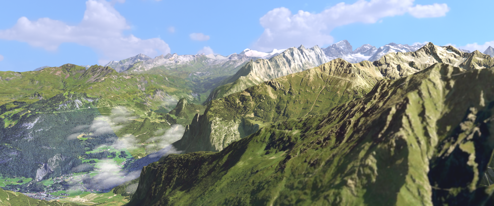

# Feather of Freedom

**Feather of Freedom** is a computer graphics project that tells a serene story of a flock of birds navigating the majestic Swiss mountains. One bird, feeling a quiet pull, separates from the group to drink from a tranquil mountain lake, high above the valley.

## Project Overview

This project aims to create a realistic and immersive scene showcasing the beauty of nature and the freedom of flight. The main elements include:

- **Scene Location:** The project captures the landscape of Homadgrätli in the Swiss Alps.
- **Tools Used:** Models and textures were obtained using RenderDoc in order to extract data from Google Maps, providing an authentic representation of the mountainous terrain.
- **Bird Animation:** The flock of birds was created using Blender's Particle System combined with the boids simulation algorithm. Rigging and animation were developed to portray natural flight dynamics and interactions with the environment, both in flight and on the ground.

## Features

- **Terrain Modeling and Texturing:** Real-world geographical data was extracted and used to replicate the Swiss mountains accurately.
- **Bird Flocking Behavior:** A boids simulation algorithm was used to generate lifelike flocking behavior, enhancing the realism of the scene.
- **Detailed Bird Animation:** Each bird is fully rigged, allowing flight and landing animations.

